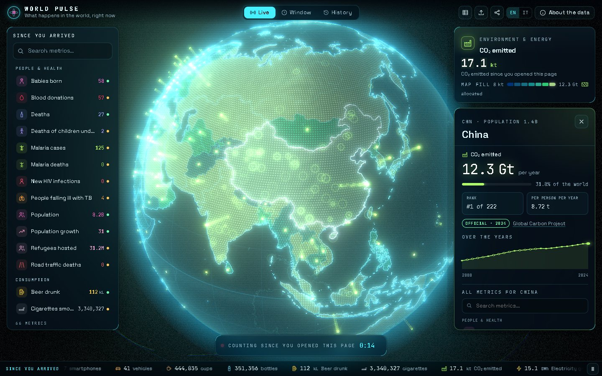
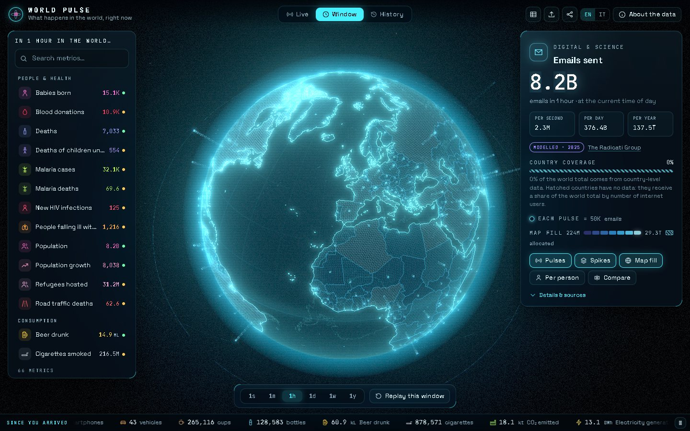
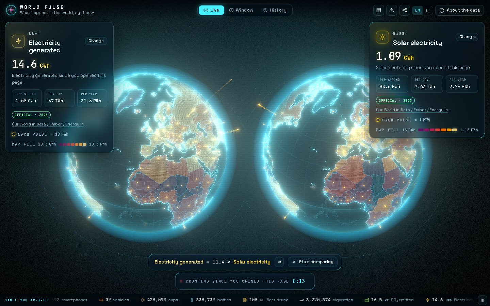
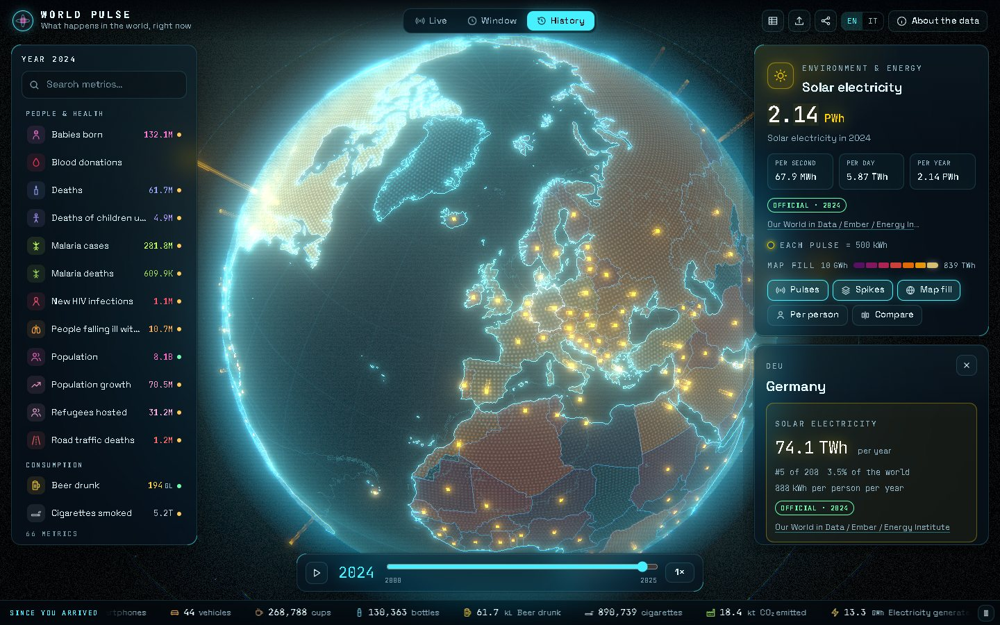
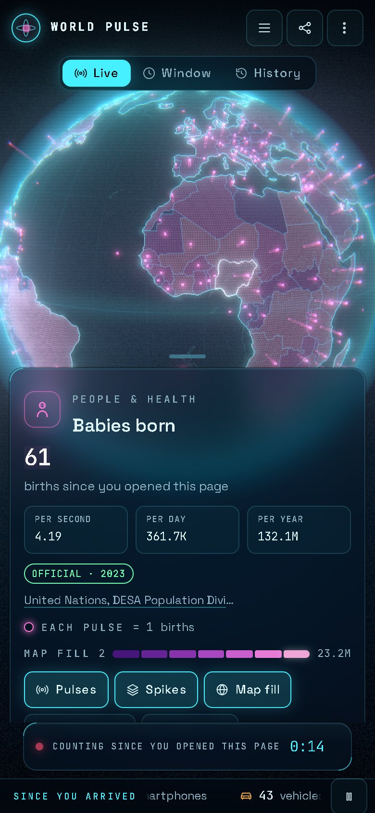

<div align="center">

# 🌐 World Pulse

**What happens in the world, right now.**

An interactive holographic 3D globe showing how many babies are born, tonnes of CO₂ emitted, iPhones sold,
emails sent and 110+ other things happen on Earth — **live** since you opened the page, over any **time window**
from one second to one year, and across **two decades of history**. Every number is sourced.

**[▶ Open the live globe](https://alessandrocapelli.github.io/world-pulse/)** · [About the data](https://alessandrocapelli.github.io/world-pulse/about)



</div>

## Features

- **Holographic globe** (Three.js, custom shaders, bloom) with day/night shading, GPU pulses, spikes and a choropleth
  with quantile classes on a perceptual colour ramp.
- **Three time modes** — _Live_ counters since you opened the page (modulated by each country's local hour),
  _Window_ totals from 1 second to 1 year with a replay, _History_ from 2000 to the latest data.
- **116 datasets** (112 metrics + 4 proxies): people & health, education & work, living conditions, consumption,
  agriculture & food, environment & energy, infrastructure & access, digital & science, economy.
- **Honest by design** — every value shows its source, data year and confidence; countries without data are hatched
  and receive a share of the world total by a declared proxy, with the coverage always visible.
- Country panel, side-by-side compare, table view, deep links, PNG export, CSV/JSON upload (kept in your browser).
- Desktop and phone layouts, English and Italian, keyboard navigation, reduced-motion support, WebGL-less fallback.
- Static prerendered site: no backend, no trackers, no runtime requests to third-party servers.

| Time window                            | Compare                                  | History                                  | Mobile                            |
| -------------------------------------- | ---------------------------------------- | ---------------------------------------- | --------------------------------- |
|  |  |  |  |

## Getting started

Requires Node.js ≥ 20.19 (22 recommended).

```bash
git clone https://github.com/AlessandroCapelli/world-pulse.git
cd world-pulse
npm ci
npm start                 # http://localhost:4200
```

| Script                                                | What it does                                                                                                         |
| ----------------------------------------------------- | -------------------------------------------------------------------------------------------------------------------- |
| `npm start`                                           | Dev server                                                                                                           |
| `npm run build`                                       | Production build with prerendered pages                                                                              |
| `npm run build:gh-pages`                              | Build for the `/world-pulse/` sub-path (+ `404.html`, `.nojekyll`, `sitemap.xml`)                                    |
| `npm run lint`                                        | ESLint                                                                                                               |
| `npm run data:validate`                               | Validate every dataset                                                                                               |
| `npm run data:fetch` / `data:build`                   | Download the public datasets into `data-raw/` and rebuild the generated metric files                                 |
| `npm run data:fetch:expanded` / `data:build:expanded` | Download and rebuild just the additional country metrics and their shared inputs, then validate the complete catalog |
| `npm run geo:build`                                   | Rebuild the country registry and TopoJSON from Natural Earth                                                         |

## Project structure

```
src/app/
  core/engine/   per-second rates, year resolution (interpolate / carry / allocate), hourly profiles, units
  core/data/     schema, catalog, Web Worker, uploads
  core/state/    signal store + URL sync (deep links)
  globe/         framework-free Three.js engine: shaders, layers, picking, camera, adaptive quality
  features/      world page, metric card, time controls, ticker, country panel, compare, table, share, upload, about
public/data/     manifest, metrics/*.json, proxies/*.json, geo/
scripts/         ETL (etl/), dataset validation, geo build, GitHub Pages post-build
```

The methodology (normalization, interpolation, allocation, coverage, time-of-day profiles) is explained on the
[About the data](https://alessandrocapelli.github.io/world-pulse/about) page, together with every source.

## Deploy

Push to `main` with _Settings → Pages → Source: GitHub Actions_. The workflow in `.github/workflows/deploy.yml`
validates the data, lints, builds with the repository sub-path and publishes.

## Data and licenses

Code © 2026 [Alessandro Capelli](https://github.com/AlessandroCapelli), released under the [MIT License](LICENSE).

The datasets in `public/data/` keep the licenses of their publishers and are listed, with links, in each metric file
and on the About page. Most are CC BY 4.0 (World Bank, Our World in Data, Global Carbon Budget, Ember, FAO, IEA,
UNHCR, Global Forest Watch); UN World Population Prospects is CC BY 3.0 IGO; **WHO data** (`malaria-cases`,
`malaria-deaths`, `road-deaths`) is CC BY-NC-SA 3.0 IGO — **non-commercial**; USGS data is public domain; curated
figures from company and industry reports are factual values cited with attribution. When reusing a dataset, cite the
original publisher.

Country shapes: [Natural Earth](https://www.naturalearthdata.com/) via [world-atlas](https://github.com/topojson/world-atlas).
Fonts: Space Grotesk and JetBrains Mono (SIL OFL).
